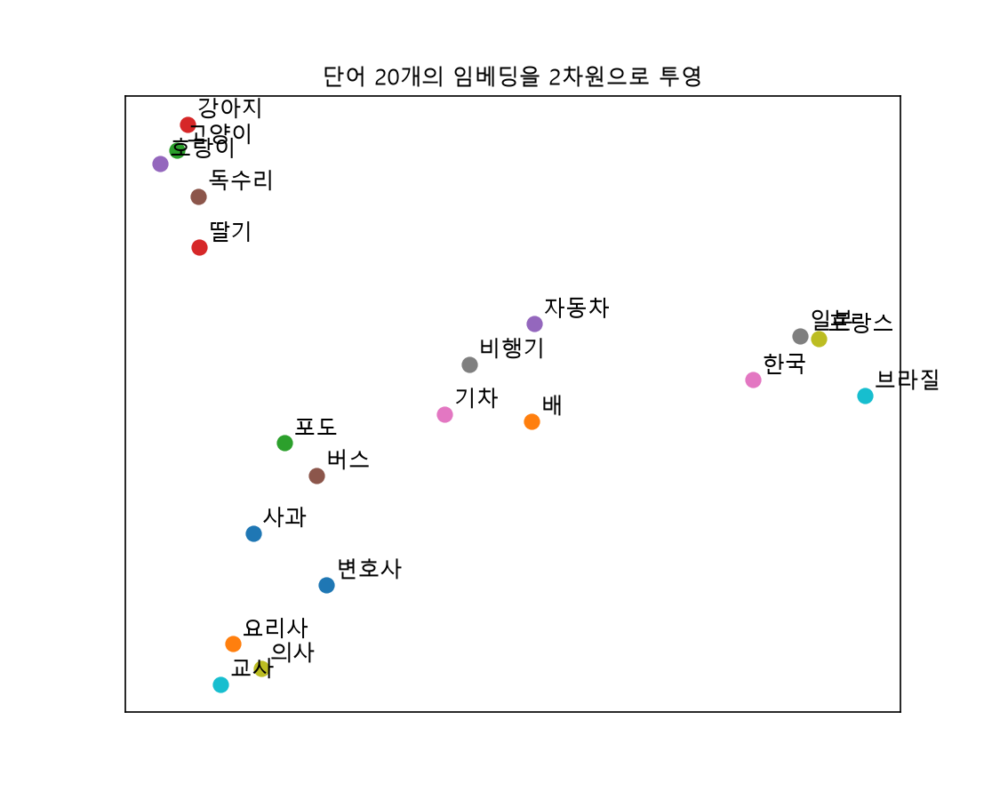

# 2주차 확인 과제

## similarity.py

|번호|문장 A|문장 B|예상|실제|예상과 다른가|
|:---:|:---:|:---:|:---:|:---:|:---:|
|1|오늘 날씨가 정말 좋다|오늘 하늘이 맑고 화창하다|상|상|같음|
|2|오늘 날씨가 정말 좋다|오늘 날씨가 정말 나쁘다|하|상|다름|
|3|나는 사과를 먹었다|사과를 나는 먹었다|하|상|다름|
|4|나는 사과를 먹었다|나는 사과를 먹지 않았다|하|상|다름|
|5|은행에 돈을 맡겼다|강가의 은행나무 아래 앉았다|하|하|같음|
|6|프로그램이 죽었다|프로세스가 종료되었다|상|하|다름|
|7|고양이가 소파 위에서 잔다|개가 마당에서 뛴다|상|하|다름|
|8|회의는 3시에 시작한다|미팅은 오후 세 시부터다|상|상|같음|
|9|파이썬으로 웹 서버 만드는 법|자바로 웹 서버 만드는 법|상|상|같음|
|10|사과 가격이 올랐다|애플 주가가 상승했다|상|하|다름|
|11|나는 사과를 먹었다|회의는 3시에 시작한다|하|하|같음|

단어의 유사도만 반영되고 의미나 문맥은 반영되지 않았다.

## search.py

```
Q: 지원 시기는 어떻게 되는거지?
   0.637  9월 7일 4시까지 서류 지원을 완료해야만 한다
   0.580  인턴십 기간은 6개월이다
   0.561  팀 면접은 11월 중 진행 예정이며 지원자에 따라 다회차로 진행될 수 있다
Q: 과정은 어떻게 알 수 있지?
   0.517  ai면접을 제외한 이후 프로세스는 대상자만 진행 가능하고 상세 일정은 대상자 개별 연락한다
   0.513  전형 절차는 다음과 같다. 서류접수, ai면접, ai활용 역량평가, 직군면접, 팀면접, 입사ai활용 역량평가는 10월 3일 토요일 오후 중 일괄진행된다
   0.470  팀 면접은 11월 중 진행 예정이며 지원자에 따라 다회차로 진행될 수 있다
Q: 개발자도 할 수 있나?
   0.473  2026 넥토리얼은 게임 프로그래머만 모집한다
   0.424  팀 면접은 11월 중 진행 예정이며 지원자에 따라 다회차로 진행될 수 있다
   0.412  인턴십 기간은 6개월이다
Q: 합격하면 뭘 할 수 있을까?
   0.517  9월 7일 4시까지 서류 지원을 완료해야만 한다
   0.506  ai면접을 제외한 이후 프로세스는 대상자만 진행 가능하고 상세 일정은 대상자 개별 연락한다
   0.500  전형 절차는 다음과 같다. 서류접수, ai면접, ai활용 역량평가, 직군면접, 팀면접, 입사ai활용 역량평가는 10월 3일 토요일 오후 중 일괄진행된다
```

## 어텐션이란?

- 단어의 요약을 버리지 않고 모두 남겨놓은 뒤 필요에 따라 참조하여 어순에 따라 필요한 의미의 단어를 기반으로 탐색할 수 있게 만들어주는 방식

---

### 2절 : 직접해보기 2

소스코드 : [vector.py](./vector.py)

실행 결과

```shell
벡터 길이: 1024
앞 5개 값: [-0.05250094  0.03134993 -0.01606604  0.02514655 -0.01395983]
사과-배: 0.46
사과-자동차: 0.467
"왕 - 남자 + 여자" 결과 벡터와 가까운 순서:
  왕  0.696
  왕비  0.655
  여자  0.655
  여왕  0.634
  왕자  0.573
  공주  0.560
  임금  0.274
  남자  0.016
```

### 5절 : 직접해보기 5

소스코드 : [similarity.py](./similarity.py)

실행 결과

```shell
0.832  |  오늘 날씨가 정말 좋다  |  오늘 하늘이 맑고 화창하다
0.786  |  오늘 날씨가 정말 좋다  |  오늘 날씨가 정말 나쁘다
0.984  |  나는 사과를 먹었다  |  사과를 나는 먹었다
0.804  |  나는 사과를 먹었다  |  나는 사과를 먹지 않았다
0.602  |  은행에 돈을 맡겼다  |  강가의 은행나무 아래 앉았다
0.676  |  프로그램이 죽었다  |  프로세스가 종료되었다
0.536  |  고양이가 소파 위에서 잔다  |  개가 마당에서 뛴다
0.876  |  회의는 3시에 시작한다  |  미팅은 오후 세 시부터다
0.801  |  파이썬으로 웹 서버 만드는 법  |  자바로 웹 서버 만드는 법
0.680  |  사과 가격이 올랐다  |  애플 주가가 상승했다
0.459  |  나는 사과를 먹었다  |  회의는 3시에 시작한다
```

### 6절 : 직접해보기 6

소스코드 : [search_origin.py](./search_origin.py)

실행 결과

```shell
Q: 시험 언제야?
   0.600  기말고사는 12월 셋째 주에 실시한다
   0.503  수강 신청 변경 기간은 개강 후 첫 주다
   0.468  장학금 신청은 학기 시작 후 2주 안에 해야 한다
Q: 책 빌리는 곳 몇 시에 닫아?
   0.701  도서관은 평일 오전 9시부터 오후 10시까지 연다
   0.466  주차장은 학생증을 등록한 차량만 이용할 수 있다
   0.457  휴학 신청은 학과 사무실에서 서류를 받아 제출한다
Q: 학교 그만두려면 어떻게 해?
   0.564  휴학 신청은 학과 사무실에서 서류를 받아 제출한다
   0.541  졸업 요건은 130학점 이상 이수와 졸업 작품 제출이다
   0.489  장학금 신청은 학기 시작 후 2주 안에 해야 한다
Q: 졸업하려면 뭐가 필요해?
   0.687  졸업 요건은 130학점 이상 이수와 졸업 작품 제출이다
   0.540  휴학 신청은 학과 사무실에서 서류를 받아 제출한다
   0.525  장학금 신청은 학기 시작 후 2주 안에 해야 한다
Q: 장학금 신청 기간이 지났으면 어떻게 해?
   0.763  장학금 신청은 학기 시작 후 2주 안에 해야 한다
   0.633  수강 신청 변경 기간은 개강 후 첫 주다
   0.617  휴학 신청은 학과 사무실에서 서류를 받아 제출한다
```

소스코드 : [search.py](./search.py)

실행 결과

```shell
Q: 지원 시기는 어떻게 되는거지?
   0.637  9월 7일 4시까지 서류 지원을 완료해야만 한다
   0.580  인턴십 기간은 6개월이다
   0.561  팀 면접은 11월 중 진행 예정이며 지원자에 따라 다회차로 진행될 수 있다
Q: 과정은 어떻게 알 수 있지?
   0.517  ai면접을 제외한 이후 프로세스는 대상자만 진행 가능하고 상세 일정은 대상자 개별 연락한다
   0.513  전형 절차는 다음과 같다. 서류접수, ai면접, ai활용 역량평가, 직군면접, 팀면접, 입사ai활용 역량평가는 10월 3일 토요일 오후 중 일괄진행된다
   0.470  팀 면접은 11월 중 진행 예정이며 지원자에 따라 다회차로 진행될 수 있다
Q: 개발자도 할 수 있나?
   0.473  2026 넥토리얼은 게임 프로그래머만 모집한다
   0.424  팀 면접은 11월 중 진행 예정이며 지원자에 따라 다회차로 진행될 수 있다
   0.412  인턴십 기간은 6개월이다
Q: 합격하면 뭘 할 수 있을까?
   0.517  9월 7일 4시까지 서류 지원을 완료해야만 한다
   0.506  ai면접을 제외한 이후 프로세스는 대상자만 진행 가능하고 상세 일정은 대상자 개별 연락한다
   0.500  전형 절차는 다음과 같다. 서류접수, ai면접, ai활용 역량평가, 직군면접, 팀면접, 입사ai활용 역량평가는 10월 3일 토요일 오후 중 일괄진행된다
```

### 6절 : 직접해보기 7

소스코드 : [multilingual.py](./multilingual.py)

실행 결과

```shell
0.963  I watched a movie with a friend yesterday
0.970  昨日友達と一緒に映画を見た
0.962  我昨天和朋友一起看了电影
0.976  어제 친구랑 영화 봤어
0.569  나는 내일 혼자 도서관에 간다
0.634  The weather is nice today
```

### 6절 : 직접해보기 8

소스코드 : [plot2d.py](./plot2d.py)

실행 결과


